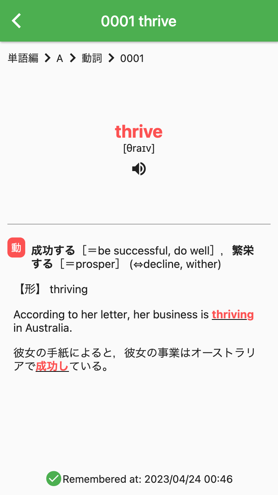
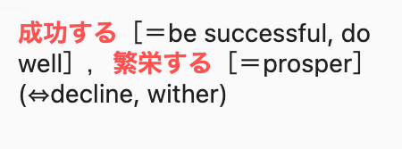
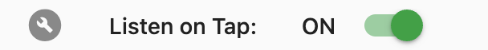
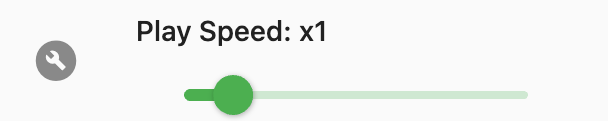
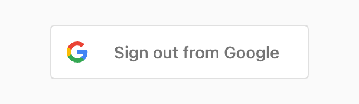

# iken Grade 1

A simple vocabulary book for Eiken Grade 1.

- [:brain: Word Status and Learning Flow](#brain-word-status-and-learning-flow)
    - [Before learning](#before-learning)
    - [Learn & Review](#learn--review)
- [:rocket: Getting Started](#rocket-getting-started)
    - [On Android](#on-android)
    - [On the Web](#on-the-web)
- [:sparkles: Features](#sparkles-features)
    1. [Signin Page](#1-signin-page)
        - [Sign in with Google](#sign-in-with-google)
    2. [Top Page](#2-top-page)
        - [Highlight/Unhighlight a word](#highlightunhighlight-a-word)
        - [Playback audio](#playback-audio)
        - [Show word details](#show-word-details)
        - [Open the configuration drawer](#open-the-configuration-drawer)
    3. [Word Page](#3-word-page)
        - [Playback audio](#playback-audio-1)
        - [See learning history](#see-learning-history)
    4. [Configuration Drawer](#4-configuration-drawer)
        - [Change word level](#change-word-level)
        - [Change word status](#change-word-status)
        - [Toggle audio playback](#toggle-audio-playback)
        - [Toggle Japanese audio playback](#toggle-japanese-audio-playback)
        - [Change playback speed](#change-playback-speed)
        - [See progress charts](#see-progress-charts)
        - [Sign out from Google](#sign-out-from-google)
- [:page_facing_up: Disclaimer](#page_facing_up-disclaimer)

## :brain: Word Status and Learning Flow

Each word has three status, depending on the learner's memorization status.

### Before learning

All words are in the `Not remembered` status. Once you have memorized the meaning of a word, move its status to `Remembered`.

### Learn & Review

You will review the words you have learned. If you cannot recall the meaning of a word, move its status to `Forgot`. If you remember the meaning of the word again, move its status back to `Remembered`.

## :rocket: Getting Started

- **On Android**  
    https://dply.me/u9gqon

- **On the Web**  
    https://eiken-grade-1.web.app

Icons by [Icons8](https://icons8.com)

## :sparkles: Features

*Eiken Grade 1* is created to compensate for the shortcomings of ordinary paper vocabulary books. It has four main pages offering various features.

<table>
    <thead>
        <tr>
            <th>1. <a href="#1-signin-page">Signin Page</a></th>
            <th>2. <a href="#2-top-page">Top Page</a></th>
            <th>3. <a href="#3-word-page">Word Page</a></th>
            <th>4. <a href="#4-configuration-drawer">Configuration Drawer</a></th>
        </tr>
    </thead>
    <tbody>
        <tr>
            <td width="25%">
                
            </td>
            <td width="25%">
                
            </td>
            <td width="25%">
                
            </td>
            <td width="25%">
                
            </td>
        </tr>
    </tbody>
</table>

### 1. Signin Page

<table>
    <tbody>
        <tr>
            <td width="25%">
                
            </td>
            <td width="75%" valign="top">
                
Sign in to <i>Eiken Grade 1</i> with your Google account using <a href="https://firebase.google.com/docs/auth" target="_blank">Firebase Authentication</a>. Your learning data will be stored in <a href="https://firebase.google.com/docs/firestore" target="_blank">Cloud Firestore</a>, making it possible to synchronize your learning data and configurations across different devices.

                <ul>
                    <li><a href="#sign-in-with-google">Sign in with Google</a></li>
                </ul>
            </td>
        </tr>
    </tbody>
</table>

#### Sign in with Google

<table>
    <tbody>
        <tr>
            <td width="25%">
                
            </td>
            <td width="75%" valign="top">
                Press the button to sign in to <i>Eiken Grade 1</i> with your Google account.
            </td>
        </tr>
    </tbody>
</table>

### 2. Top Page

<table>
    <tbody>
        <tr>
            <td width="25%">
                
            </td>
            <td width="75%" valign="top">
                
A scrollable list of words and their meanings

                <ul>
                    <li><a href="#highlightunhighlight-a-word">Highlight/Unhighlight a word</a></li>
                    <li><a href="#playback-audio">Playback audio</a></li>
                    <li><a href="#show-word-details">Show word details</a></li>
                    <li><a href="#open-the-configuration-drawer">Open the configuration drawer</a></li>
                </ul>
            </td>
        </tr>
    </tbody>
</table>

#### Highlight/Unhighlight a word

The status of an unhighlighted word is `Not remembered`.　Once you have learned a word, you can tap it to make its status `Rememembered`. The meaning of the word will be automatically hidden (just like covered with a red sheet). If you cannot remember the meaning of a hidden word when reviewing, tap the word to make its status `Forgot`.

<table>
    <thead>
        <tr>
            <th style="text-align: center"><code>Not remembered</code></th>
            <th style="text-align: center"><code>Remembered</code></th>
            <th style="text-align: center"><code>Forgot</code></th>
        </tr>
    </thead>
    <tbody>
        <tr>
            <td style="width: calc(100% / 3)">
                
            </td>
            <td style="width: calc(100% / 3)">
                
            </td>
            <td style="width: calc(100% / 3)">
                
            </td>
        </tr>
    </tbody>
</table>

#### Playback audio

<table>
    <tbody>
        <tr>
            <td width="25%">
                
            </td>
            <td width="75%" valign="top">
                Listen to the pronunciation by tapping the English word (unless <code><a href="#toggle-audio-playback">Toggle audio playback</a></code> is turned off). If <code><a href="#toggle-japanese-audio-playback">Toggle Japanese audio playback</a></code> is turned on, Japanese will be played after English. (See <code><a href="#4-configuration-drawer">Configuration Drawer</a></code>)
            </td>
        </tr>
    </tbody>
</table>

#### Show word details

<table>
    <tbody>
        <tr>
            <td width="25%">
                
            </td>
            <td width="75%" valign="top">
                See the details of a word by tapping the meaning of it (see <code><a href="#3-word-page">Word Page</a></code>).
            </td>
        </tr>
    </tbody>
</table>

#### Open the configuration drawer

<table>
    <tbody>
        <tr>
            <td width="25%">
                
            </td>
            <td width="75%" valign="top">
                Open the configuration drawer by tapping the icon of your Google account on the right side of the application bar (See <code><a href="#4-configuration-drawer">Configuration drawer</a></code>).
            </td>
        </tr>
    </tbody>
</table>

### 3. Word Page

<table>
    <tbody>
        <tr>
            <td width="25%">
                
            </td>
            <td width="75%" valign="top">
                
Word details and learning history

                <ul>
                    <li><a href="#playback-audio-1">Playback audio</a></li>
                    <li><a href="#see-learning-history">See learning history</a></li>
                </ul>
            </td>
        </tr>
    </tbody>
</table>

#### Playback audio

<table>
    <tbody>
        <tr>
            <td width="25%">
                
            </td>
            <td width="75%" valign="top">
                Listen to the pronunciation by tapping the English word (unless <code><a href="#toggle-audio-playback">Toggle audio playback</a></code> is turned off). If <code><a href="#toggle-japanese-audio-playback">Toggle Japanese audio playback</a></code> is turned on, Japanese will be played after English. (See <code><a href="#4-configuration-drawer">Configuration Drawer</a></code>)
            </td>
        </tr>
    </tbody>
</table>

#### See learning history

The learning history is displayed according to the word status.

<table>
    <thead>
        <tr>
            <th style="text-align: center"><code>Not remembered</code></th>
            <th style="text-align: center"><code>Remembered</code></th>
            <th style="text-align: center"><code>Forgot</code></th>
        </tr>
    </thead>
    <tbody>
        <tr>
            <td style="width: calc(100% / 3)">
                
            </td>
            <td style="width: calc(100% / 3)">
                
            </td>
            <td style="width: calc(100% / 3)">
                
            </td>
        </tr>
    </tbody>
</table>

### 4. Configuration Drawer

<table>
    <tbody>
        <tr>
            <td width="25%">
                
            </td>
            <td width="75%" valign="top">
                
You can change the configurations and see the progress chart.

                <ul>
                    <li><a href="#change-word-level">Change word level</a></li>
                    <li><a href="#change-word-status">Change word status</a></li>
                    <li><a href="#toggle-audio-playback">Toggle audio playback</a></li>
                    <li><a href="#toggle-japanese-audio-playback">Toggle Japanese audio playback</a></li>
                    <li><a href="#change-playback-speed">Change playback speed</a></li>
                    <li><a href="#see-progress-charts">See progress charts</a></li>
                    <li><a href="#sign-out-from-google">Sign out from Google</a></li>
                </ul>
            </td>
        </tr>
    </tbody>
</table>

#### Change word level

<table>
    <tbody>
        <tr>
            <td width="25%">
                
            </td>
            <td width="75%" valign="top">
                Choose the level of words to display from <code>A</code>, <code>B</code>, <code>C</code>, and <code>Idioms</code>.
            </td>
        </tr>
    </tbody>
</table>

#### Change word status

<table>
    <tbody>
        <tr>
            <td width="25%">
                
            </td>
            <td width="75%" valign="top">
                Choose the status of the word to be displayed from <code>Not remembered</code> (including <code>Forgot</code>), <code>Remembered</code>, <code>Forgot</code>, and <code>All</code>.
            </td>
        </tr>
    </tbody>
</table>

#### Toggle audio playback

<table>
    <tbody>
        <tr>
            <td width="25%">
                
            </td>
            <td width="75%" valign="top">
                Toggle whether or not to playback the pronunciation on tapping a word.
            </td>
        </tr>
    </tbody>
</table>

#### Toggle Japanese audio playback

<table>
    <tbody>
        <tr>
            <td width="25%">
                
            </td>
            <td width="75%" valign="top">
                Toggle whether or not to playback Japanese after the pronunciation playback.
            </td>
        </tr>
    </tbody>
</table>

#### Change playback speed

<table>
    <tbody>
        <tr>
            <td width="25%">
                
            </td>
            <td width="75%" valign="top">
                Change playback speed from <code>0.5x</code> to <code>4x</code>.
            </td>
        </tr>
    </tbody>
</table>

#### See progress charts

<table>
    <tbody>
        <tr>
            <td width="25%">
                
            </td>
            <td width="75%" valign="top">
                The charts above show the number of <code>Remembered</code> words at each level. The chart below shows the total number of <code>Remembered</code> words since you started learning.
            </td>
        </tr>
    </tbody>
</table>

#### Sign out from Google

<table>
    <tbody>
        <tr>
            <td width="25%">
                
            </td>
            <td width="75%" valign="top">
                Sign out from <i>Eiken Grade 1</i> to switch your Google accounts for saving your learning data and configurations.
            </td>
        </tr>
    </tbody>
</table>

## :page_facing_up: Disclaimer

> **Warning**  
> Although the code in this repository is [MIT licensed](../LICENSE), the word and sound assets used in *Eiken Grade 1* are third-party copyrighted works and are reproduced for the author's personal use under [Article 30 of the Copyright Act](https://www.japaneselawtranslation.go.jp/en/laws/view/4207#je_ch2sc3sb5at1). Therefore, distribution of these assets is prohibited.  
> https://github.com/neutron0831/eiken-grade-1/blob/668d940329f9cfd8a81217a4653d61a2974623a5/.gitignore#L12-L14